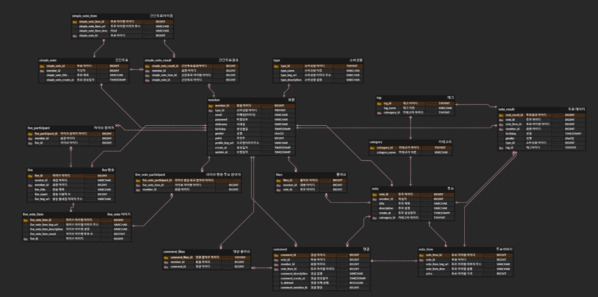

# { 여기는 로고 및 배너를 넣을 공간 입니다. }

# 골라쥬 🏦

💰 본 프로젝트는 삼성 청년 SW 아카데미 2학기 공통 프로젝트 결과물입니다.

## 개요🌱

- 현대인 한명이 하루에 접하는 정보량은 20세기 초 사람들이 평생 접한 정보량에 버금갈 정도
- 수많은 정보는 선택의 다양성을 넓혔다
- 하루에도 수 천 가지의 선택을 해야하는 우리를 위한 웹 어플리케이션
- 내 선택을 골라쥬~

## 팀 재첩국🍵

| 김하영                                  | 배영환                                        | 송승준                                |
| --------------------------------------- | --------------------------------------------- | ------------------------------------- |
|              | .jpg) |            |
| { 여기는 개인페이지 링크 와 자기 소개 } |                                               |                                       |
| **이상훈**                              | **이시은**                                    | **황호철**                            |
|            |                |  |
|                                         |                                               |                                       |

## 프로젝트 기간💞️

### 진행기간

- 2024년 1월 8일 ~ 2023년 2월 16일(6주)👋

  

  ### 세부내용

 일시       진행내용                                                      특이사항                                                      비고                                                         
--------  ------------------------------------------------------------  -----------------------------------------------------------  -----------------------------------------------------------

{ 주단위 일정 같은 거 넣으면 좋을거 같아요 }

## 개발 환경 👀

    <h1>📚 STACKS</h1>

  

    
    
    
        
           
        
        
        
    
      
           
        
      
        
        
    
           
       
    
      

#### 기술스택 {수정 필요}

🖱 Frontend

- Visual Studio Code

- JavaScript es6++

- Node.js 20.11.0

- vite 5.0.8

- react 18.2.0

- tailwindcss 3.4.1

🖱 Backend

- IntelliJ

- JAVA 17

- spring-boot : 3.2.2

- spring-boot-jpa

- Spring Security

- mysql

- redis

🖱 Web RTC

- openvidu 2.19.0

🖱 CI/CD

- aws ec2

- docker

- nginx

- jenkins

#### 협업 툴👊

- Notion
- Mattermost
- gitlab
- jira
- google docs

## ERD 🌐

#### <특이사항>

- { 알려 주고 싶은 내용들 넣읍시다. }

## 아키텍쳐♟️

## 웹페이지 🕸️

### 0. 구조

### 1. 메인페이지

​	✔️네비게이션바를 통해 페이지 탐색 가능

​	✔️메인 투표창을 통해 쉽게 투표 가능

​	✔️top5 투표 목록 구성

### 2. 회원가입

​	✔️ 한영, 숫자 아이디 - 숫자특수문자영어 비밀번호로 회원가입

​	✔️ 소셜회원가입?

### 3. 투표생성

​	✔️ 간단골라쥬: 상품 관련 사진과 제목만 기입하면 투표 등록 (2~4개 선택지)

​	✔️ 상품골라쥬: 상품사진, 제목, 카테고리, 가격을 입력하면 투표 등록 (2~4게 선택지)

​	✔️ 지금골라쥬: 화면을 통한 투표

### 4. 투표모아쥬

​	✔️ 

	

### 5. 통계보여쥬

​	✔️ 

​	✔️ 

### 6. 지금골라쥬

​	✔️ 

​	✔️ 

​	✔️ 

### 7. 소비성향알려쥬

​	✔️ 

​	✔️ 

### 8. 마이페이지

​	✔️ 

​	✔️ 

